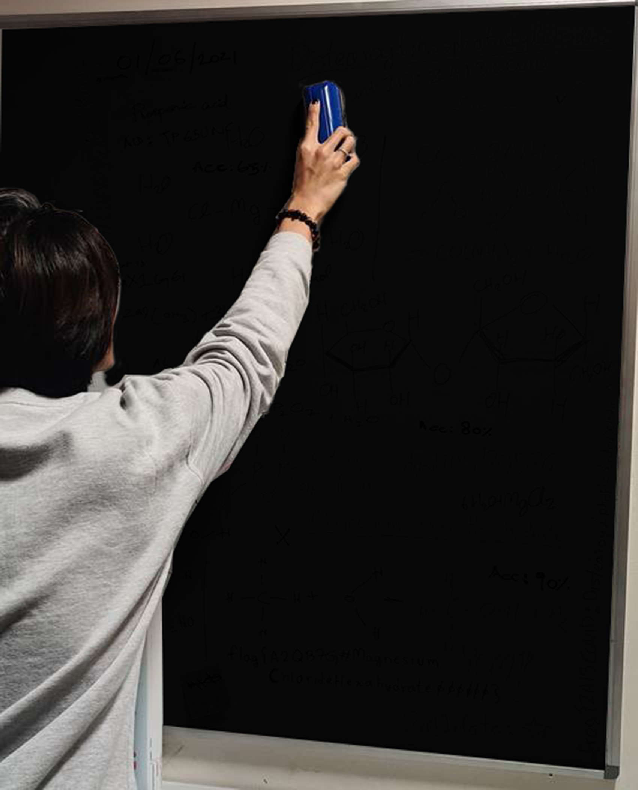
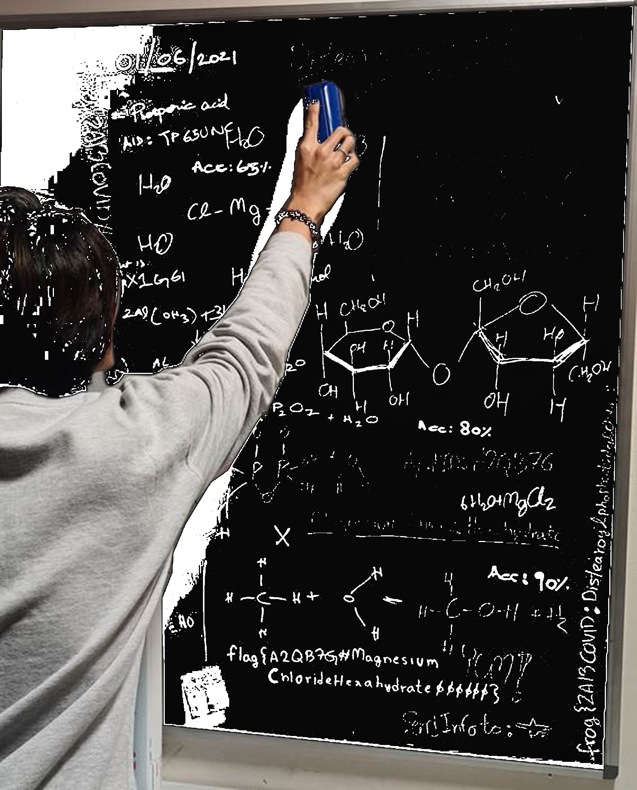
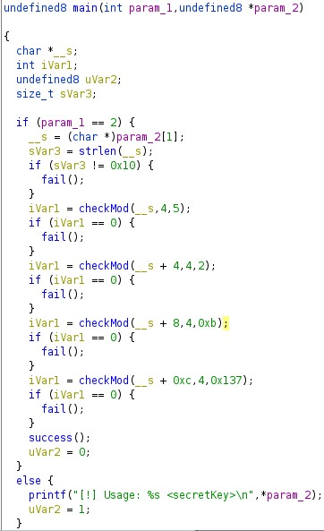

# NZ Cyber Security Challange 2021

## Challenge 2
The challenge provides a picture of a scientist cleaning a black board. Steganography is used to hide the board's contents.<br/>

You can already see a little bit. Many tools can be used to reveal but I used Photoshop with its Blending feature.<br/>

And we got the flag:
```
flag{A2QB7G#MagnesiumChlorideHexahydrate000000}
```

## Challenge 3
A login form with username and password was given. A simple check on source code reveals the username and password in a commented section
```html
<!-- Username: dumbh4ck5 Password: XorIsNotSooS3cur3 -->
```
Enter the details in and the flag appears.
```
flag{KLY5FQ#Dibasicsodiumphosphatedihydrate000}
```

## Challenge 6
A [crackme](chal6/crackme) file was given. It is an executable file so I threw it in Ghidra to have a look.<br/>
Here is the main function:<br/>

1. First it checks the parameter we give to be exactly 16 chars
2. Call `checkMod()` function with a parameter substring, every 4 chars.
3. `checkMod()` will convert that 4 characters into integers and sum them up, for example, "AAAA" will be 41 + 41 + 41 + 41. After that, it checks if that sum is divisible by a given number - third parameter, which are `5, 2, 0xb = 11, 0x137 = 311`

After some tinkering with ASCII table, I came up with `FFFFBBBBBBBBPPPG`. Which can be explained:
```
FFFF = 70 + 70 + 70 + 70 = 280. % 5 = 0
BBBB = 42 + 42 + 42 + 42 = 168. % 2 = 0 and % 11 = 0
PPPG = 80 + 80 + 80 + 71 = 311. % 311 = 0
```
There are many combinations can work.

Passing that to the program and we got the flag:
```
./crackme FFFFBBBBBBBBPPPG
[+] You win!
[+] Here's your flag - Flag{B78YYB#N-ditetradecylacetamide00000000000}
```